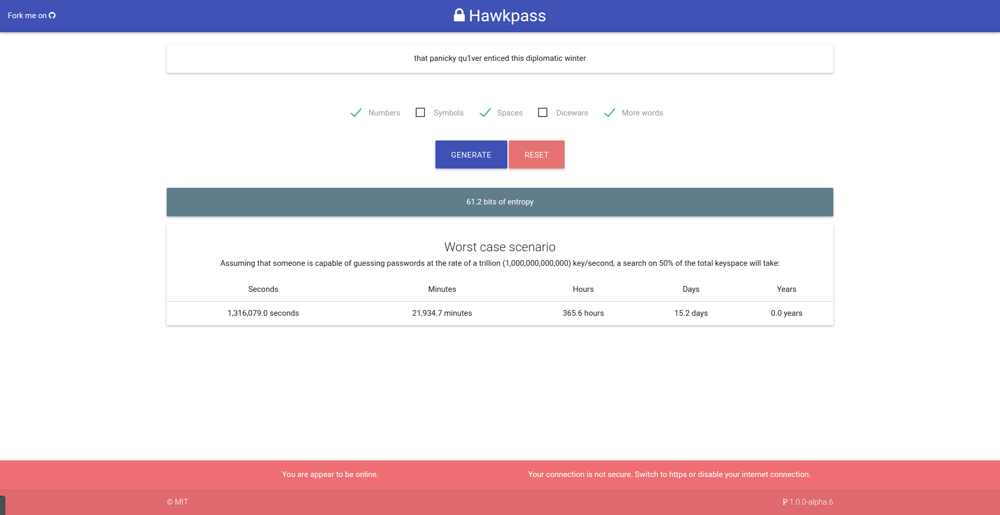

<p align="center">
  
</p>
<p align="center">
  
  
  
  
  
</p>
<p align="center">
A simple cryptographically secure (SHA-256) random number generator that uses entropy collected from your mouse movements to generate <b>easy to remember passwords</b> based on the <a href="http://world.std.com/~reinhold/diceware.html">Diceware</a> list.
</p>
<p align="center">
  
</p>

## Live version

For a live version visit https://kalpetros.github.io/hawkpass-web/

## Download

You can download the desktop version from the [releases](https://github.com/kalpetros/hawkpass-desktop/releases) page.

## Testing locally

First install the necessary dependencies by running:

```
$ npm install
```

To run the app in your browser type:

```
$ npm run develop
```

## Contributing

Contributions are welcome! To get started please read the [contribution guidelines](https://github.com/kalpetros/hawkpass-desktop/blob/master/CONTRIBUTING.md).

Report any issues or feature requests you have [here](https://github.com/kalpetros/hawkpass-desktop/issues).

## Licence

[MIT](https://github.com/kalpetros/hawkpass-desktop/blob/master/LICENSE)
